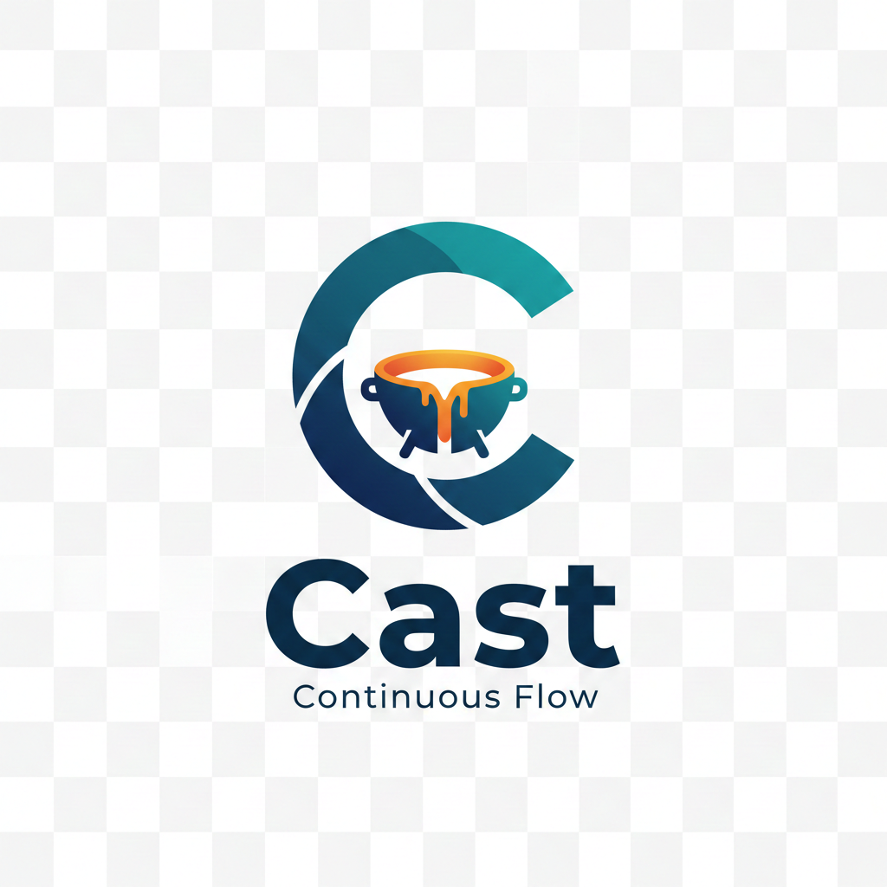

<p align="center">
  
</p>

# Cast

[中文文档](./README_zh.md)

A lightweight local CI/CD tool for rapid integration and deployment.

## Why Cast?

There are many CI/CD tools out there — Jenkins, GitHub Actions, Makefile, Ansible, Travis CI, etc. But they're often too heavy for quick delivery:

- **Jenkins** requires a full server deployment and web UI.
- **GitHub Actions / Travis CI** are platform-specific.
- **Ansible + Makefile** need to be configured together every time.

Cast solves these pain points with a single config file and CLI.

### Best For

- Solo full-stack developers who want fast feedback loops.
- Quick deployments of frontend/backend projects to servers.

### Not Ideal For

- Multi-person production environments requiring strict release management.

## Installation

```bash
go install github.com/koyeo/cast@latest
```

> **Note:** `go install` compiles and installs the `cast` binary to `$GOPATH/bin`. Make sure `$GOPATH/bin` is in your `$PATH`.

## Quick Start

### 1. Initialize Configuration

```bash
cast init
```

This will:
1. Create a `cast.yaml` file if it doesn't exist.
2. Add `.cast` to `.gitignore` to ignore the temporary workspace.

You can also specify a custom config file name:

```bash
cast init cast.production.yml
```

### 2. Edit `cast.yaml`

Here's an example that builds locally, deploys to a server, and restarts the service:

```yaml
version: 1.0
servers:
  server-1:
    comment: Example server
    host: 192.168.1.10
    user: root                                 # Uses ~/.ssh/id_rsa by default
tasks:
  task-1:                                      # Task name
    comment: Example task                      # Task description
    steps:
      - use: hi                                # Inherit steps from "hi" task
      - run: go build -o foo foo.go            # Build locally
      - deploy:
          servers:
            - use: server-1                    # Target server
          mappers:
            - source: ./foo                    # Local file
              target: /app/foo/bin/foo         # Remote destination
          executes:
            - run: supervisorctl restart foo   # Restart service on server
      - run: rm foo                            # Local cleanup
  hi:
    comment: Say hello
    steps:
      - run: echo "Hi! this is from cast~"
```

### 3. Run a Task

```bash
cast run task-1
```

Run multiple tasks:

```bash
cast run task-1 hi
```

## CLI Reference

### `cast init`

Initialize the `cast.yaml` config file and update `.gitignore`.

### `cast run <task...>`

Execute one or more tasks by name.

### `cast list`

List all configured resources including tasks, servers, and environment variables.

## Configuration Reference

### Servers

```yaml
servers:
  server_1:                         # Server identifier (used in deploy tasks)
    comment: My server              # Description
    host: 192.168.1.5               # Server address
    port: 2222                      # Port (default: 22)
    user: root                      # Username
    password: 123456                # Password (alternative to identity_file)
    identity_file: ~/.ssh/id_rsa    # Private key file (default: ~/.ssh/id_rsa)
```

### Environment Variables

```yaml
envs:
  k1: v1                            # Global key-value environment variables
  k2: v2
```

### Deploy File Mapping

| source  | target            | Remote result             |
|:--------|:------------------|:--------------------------|
| `file1` | `/app/test/file1` | `/app/test/file1`         |
| `file1` | `/app/test/file2` | `/app/test/file2`         |
| `file1` | `/app/test`       | `/app/test`               |
| `file1` | `/app/test/`      | `/app/test/file1`         |
| `dir1`  | `/app/test/dir2`  | `/app/test/dir2`          |
| `dir1`  | `/app/test/dir2/` | `/app/test/dir1/dir2`     |
| `dir1`  | `/app/test/`      | `/app/test/dir1`          |
| `dir1`  | `/app/test`       | `/app/test`               |

## Feedback

For questions, contributions, or more information, reach out via email: koyeo@qq.com.

## Contributing

Pull requests are welcome. For major changes, please open an issue first to discuss what you would like to change.

## License

[MIT](https://choosealicense.com/licenses/mit/)
